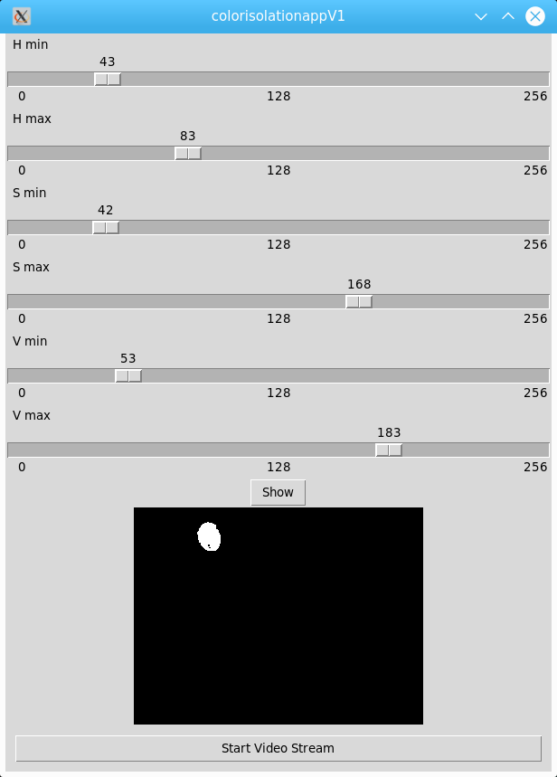

# OpenCV Color Tracking Demo 
This demo is based and tested on the DragonBoard 820c, but should be able to work on varying platforms.  In summary, it counts  objects by color passing in the same direction through the camera field of view.  It can count multiple objects simultaneously.

### Setup
This demo uses Debian builds of the Dragonboard 820c from Linaro. These can currently be found [here](http://snapshots.linaro.org/96boards/dragonboard820c/linaro/debian/ "820c Snapshots"). Build 182 was used for initial development and testing.

Installation of python, OpenCV and PIP install of several python libraries are also required.  There are plenty of sites that describe how to set this up.
 * Instructions for installing OpenCV found here
 

Camera:  I have initially used a USB camera but plan to transition to a camera mezzanine connected to the DB820c
Lighting: It is important to create a setup where lighting is controlled and repeatable.  This is so that when you determine your HSV settings, they are repeatable.  

Example of physical setup components is shown below.  It can be seen that a PVC pipe was cut to allow a camera to see the objects as they flow by.  It was set up on a 10 degree incline.


Also a small light is important to control the lighting.  Initial prototype was just a shoebox spray painted white on the inside. A hole was cut in top for light and camera placement. 

# Demo usage flow
There are a few steps to perform in order to get the demo set up for your physical environmnet.  

## Determine HSV Settings
First, you must discover the HSV min and max values for your test environment.  This is sensative to lighting and the objects being identified by color. To do this, build out your environment with controlled lighting.  Then run colorIsolationApp.py from this repo on the DB820c.  
`$python colorisolationapp.py`

An example of this tool is shown below: 


The field of view should contain your targeted environment along with all of the colors you wish to isolate from each other.  With the sliders in the colorIsolationApp.py, move them until only the color of interest can be seen and all other colors are blocked (black).  Press "Show" and the HSV min and max values will be printed to the terminal window.  Save these values for the next step.

Once the above is done for all colors, edit the track_mm.py file and update the HSV values in the initialization section to match the values from the above step.  Save the file and you should be ready to go.

## Run the Demo

Finally, run the track_mm.py file and watch the counters increment as the associated colors roll through the screen.
`python track_mm.py 2> /dev/null`

The default configuration will display all six color masks as well as the frame image.  These look like the following:


# Debugging and tuning
 * If you start the app and it quietly closes, make sure your camera is connected
 * To see how long is required to process one frame, uncomment the following code in track_mm.py
 ```
        #Debug code to gauge loop timing
        if millis1 != 0: 
            millis2 = millis1
            millis1 = int(round(time.time() * 1000))
        else:
            millis1 = int(round(time.time() * 1000))
        millis = millis1-millis2
        print "MiliSeconds per processing frame: ", millis
 ```
 
# Other notes

Additional tuning is likely required tied to the test environment and how fast color objects are flowing through the field of view.  These include the following:


