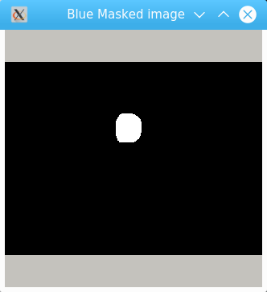

# OpenCV Color Tracking Demo 
This demo is based and tested on the DragonBoard 820c, but should be able to work on varying platforms.  In summary, it counts  objects by color passing in the same direction through the camera field of view.  It can count multiple objects simultaneously.

### Setup
This demo uses Debian builds of the Dragonboard 820c from Linaro. These can currently be found [here](http://snapshots.linaro.org/96boards/dragonboard820c/linaro/debian/ "820c Snapshots"). Build 182 was used for initial development and testing.

Installation of python, OpenCV and PIP install of several python libraries are also required. Starting point documentation for this can be found at the sites below:
 * [OpenCV build instructions](https://docs.opencv.org/master/d7/d9f/tutorial_linux_install.html)
 * [96Boards Blog description](https://www.96boards.org/blog/part-2-home-surveillance-project-96boards/) Note: DB820c has enough RAM to allow the user to skip the steps that create swap space.
 * [96Boards Forum entry](https://discuss.96boards.org/t/opencv-3-2-install-dependencies-error/2139/2)
  
**Required Hardware:**

Camera:  I have initially used a USB camera but plan to transition to a camera mezzanine connected to the DB820c

Lighting: It is important to create a setup where lighting is controlled and repeatable.  This is so that when you determine your HSV settings, they are repeatable.  

Example of physical setup components is shown below.  It can be seen that a PVC pipe was cut to allow a camera to see the objects as they flow by.  It was set up on a 10 degree incline.


Also a small light is important to control the lighting.  Initial prototype was just a shoebox spray painted white on the inside. A hole was cut in top for light and camera placement. 

# Demo usage flow
There are a few steps to perform in order to get the demo set up for your physical environmnet.  

## Determine HSV Settings
First, you must discover the HSV min and max values for your test environment.  This is sensative to lighting and the objects being identified by color. To do this, build out your environment with controlled lighting.  Then run colorIsolationApp.py from this repo on the DB820c.  
`$python colorisolationapp.py`

An example of this tool is shown below: 


The field of view should contain your targeted environment along with all of the colors you wish to isolate from each other.  With the sliders in the colorIsolationApp.py, move them until only the color of interest can be seen and all other colors are blocked (black).  Press "Show" and the HSV min and max values will be printed to the terminal window.  Save these values for the next step.

Once the above is done for all colors, edit the `track_mm.py` file and update the HSV values in the initialization section for each color to match the values from the above step.  Save the file and you should be ready to go.

## Run the Demo

Finally, run the track_mm.py file and watch the counters increment as the associated colors roll through the screen.
`python track_mm.py 2> /dev/null`

The default configuration will display all six color masks as well as the frame image.  These look like the following:



# Debugging and tuning
 * If you start the app and it quietly closes, make sure your camera is connected
 * To see how long is required to process one frame, uncomment the following code in track_mm.py
 ```
        #Debug code to gauge loop timing
        if millis1 != 0: 
            millis2 = millis1
            millis1 = int(round(time.time() * 1000))
        else:
            millis1 = int(round(time.time() * 1000))
        millis = millis1-millis2
        print "MiliSeconds per processing frame: ", millis
 ```
## Customizing the tracking algorithm
There are surely many creative algorithms to track and count the objects as they move the field of view.  The primary routine that does this in the `def newObjectCheck(self):` method in the `MM.py` file.  Since the objects can move at variable speeds, stitching the objects across frames will have corner cases where it is challenging to determine if the object is new or a previously existing object that has moved. If you come up with one, please let me know!  I would love to see other creative ways to solve this while increasing accuracy.

## Customizing the OpenCV filters
In the initial implementation, I have primarily used the following code in `track_mm.py` to clean up the colored objects moving through the frame:
```
            # Set up the min and max HSV settings 
            mask=cv2.inRange(hsvframe, mmColor.getHSV_min(), mmColor.getHSV_max())  # Red Mask
            # Get rid of noise
            mask = cv2.erode(mask, kernel7, iterations=1)
            mask = cv2.dilate(mask, kernel7, iterations=3)
    
            # Only return the contours parameter and ignore hierarchy parm, hence [-2]    
            # CHAIN_APPROX_SIMPLE to return less contour points (faster/less memory)
            contours0 = cv2.findContours(mask,cv2.RETR_EXTERNAL,cv2.CHAIN_APPROX_SIMPLE)[-2]
```
Various kernel sizes and erode/dialate functions from OpenCV are encouraged to be experimented with, with the goal of decreasing the time taken to process each frame.  Current implementation is around 65-70mS per frame.  The faster each frame is processed, the tracking algorithm can then be tightened up for more accurate tracking.  I would also be interested in seeing and testing creative solutions that can decrease this loop time.  A faster and more expensive camera could a quick way to increase accuracy.  I started out with a simple off-the-shelf USB camera that's only 30 fps.  Another option is to redesign and create a multi-threading solution that captures frames in parallel to the frame processing.

# Other notes

Additional tuning is likely required tied to the test environment and how fast color objects are flowing through the field of view.  These include the following:


